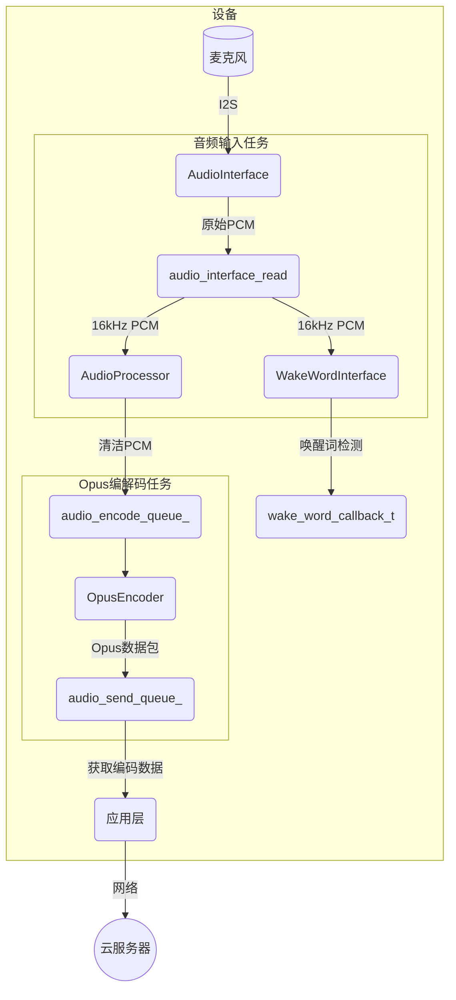
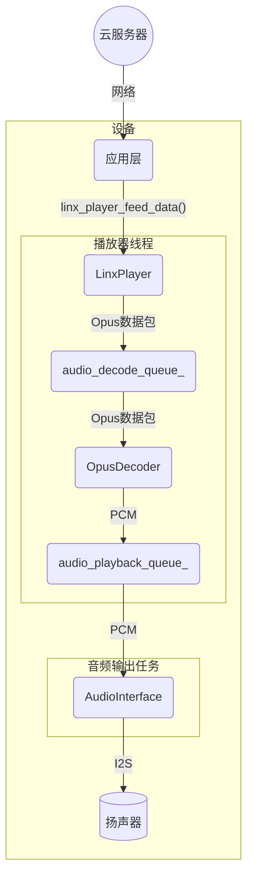

# 音频服务架构

音频服务是负责管理所有音频相关功能的核心组件，包括从麦克风捕获音频、处理音频、编码/解码以及通过扬声器播放音频。它采用模块化设计，高效运行，主要操作在专用的FreeRTOS任务中运行以确保实时性能。

## 核心组件

### 已实现组件

-   **<mcfile name="audio_interface.h" path="/Users/sunqirui/gitlab/aiagent/linx-os-sdk/src/audio/audio/audio_interface.h"></mcfile>**: 音频接口抽象层，提供统一的音频录制和播放接口。支持多平台实现（PortAudio、ESP32、ALSA等）。
-   **<mcfile name="audio_codec.h" path="/Users/sunqirui/gitlab/aiagent/linx-os-sdk/src/audio/codecs/audio_codec.h"></mcfile>**: 音频编解码器接口，支持多种音频格式的编码和解码。目前主要实现了Opus编解码器。
-   **<mcfile name="wake_word_interface.h" path="/Users/sunqirui/gitlab/aiagent/linx-os-sdk/src/audio/wake_words/wake_word_interface.h"></mcfile>**: 唤醒词检测接口，用于检测关键词（如"你好，小智"、"Hi, ESP"）。支持回调机制和Opus编码输出。
-   **<mcfile name="linx_player.h" path="/Users/sunqirui/gitlab/aiagent/linx-os-sdk/src/audio/play/linx_player.h"></mcfile>**: 音频播放器，提供完整的音频播放功能，包括状态管理、缓冲区管理和线程安全的播放控制。
-   **<mcfile name="opus_codec.h" path="/Users/sunqirui/gitlab/aiagent/linx-os-sdk/src/audio/codecs/opus_codec.h"></mcfile>**: Opus编解码器实现，提供高压缩比和低延迟的语音编码，适用于语音流传输。

### 待实现组件

-   **`AudioService`**: 中央协调器，负责初始化和管理所有其他音频组件、任务和数据队列。
-   **`AudioProcessor`**: 对麦克风输入流进行实时音频处理，通常包括声学回声消除（AEC）、噪声抑制和语音活动检测（VAD）。
-   **`VAD模块`**: 语音活动检测模块，用于检测音频流中的语音活动。
-   **`OpusResampler`**: 用于在不同采样率之间转换音频流的工具（例如，从编解码器的原生采样率重采样到处理所需的16kHz）。

## 线程模型

服务通过三个主要任务并发处理音频管道的不同阶段：

1.  **`AudioInputTask`**: 专门负责从 `AudioCodec` 读取原始PCM数据。然后根据当前状态将这些数据馈送给 `WakeWord` 引擎或 `AudioProcessor`。
2.  **`AudioOutputTask`**: 负责音频播放。它从 `audio_playback_queue_` 检索解码的PCM数据，并将其发送到 `AudioCodec` 在扬声器上播放。
3.  **`OpusCodecTask`**: 处理编码和解码的工作任务。它从 `audio_encode_queue_` 获取原始音频，将其编码为Opus数据包，并将它们放入 `audio_send_queue_`。同时，它从 `audio_decode_queue_` 获取Opus数据包，将其解码为PCM，并将结果放入 `audio_playback_queue_`。

## 目录结构

```
src/audio/
├── CMakeLists.txt              # 构建配置
├── README.md                   # 本文档
├── audio/                      # 音频接口层
│   ├── audio_interface.h       # 音频接口定义
│   ├── audio_interface.c       # 音频接口实现
│   ├── audio_stub.h           # 音频接口桩实现
│   ├── audio_stub.c           # 音频接口桩实现
│   └── test/                  # 测试代码
├── codecs/                     # 音频编解码器
│   ├── audio_codec.h          # 编解码器接口定义
│   ├── audio_codec.c          # 编解码器接口实现
│   ├── opus_codec.h           # Opus编解码器接口
│   ├── opus_codec.c           # Opus编解码器实现
│   ├── codec_stub.h           # 编解码器桩实现
│   ├── codec_stub.c           # 编解码器桩实现
│   └── test/                  # 测试代码
├── play/                       # 音频播放器
│   ├── linx_player.h          # 播放器接口定义
│   ├── linx_player.c          # 播放器实现
│   └── test/                  # 测试代码
├── wake_words/                 # 唤醒词检测
│   ├── wake_word_interface.h  # 唤醒词接口定义
│   ├── wake_word_interface.c  # 唤醒词接口实现
│   ├── wake_word_stub.h       # 唤醒词桩实现
│   └── wake_word_stub.c       # 唤醒词桩实现
└── vad/                        # 语音活动检测（待实现）
```

## 数据流

有两个主要的数据流：音频输入（上行）和音频输出（下行）。

### 1. 音频输入（上行）流程

此流程从麦克风捕获音频，处理音频，编码音频，并准备发送到服务器。



-   `AudioInputTask` 通过 `audio_interface_read()` 持续从 `AudioInterface` 读取原始PCM数据。
-   数据同时馈送给 `WakeWordInterface` 进行唤醒词检测和 `AudioProcessor` 进行清理（AEC、VAD）。
-   处理后的PCM数据被推送到 `audio_encode_queue_`。
-   `OpusCodecTask` 获取PCM数据，将其编码为Opus格式，并将结果数据包推送到 `audio_send_queue_`。
-   应用程序可以检索这些Opus数据包并通过网络发送。

### 2. 音频输出（下行）流程

此流程接收编码的音频数据，解码并在扬声器上播放。



-   应用程序从网络接收Opus数据包，并通过 `linx_player_feed_data()` 推送到 `LinxPlayer`。
-   `LinxPlayer` 内部的线程将这些数据包放入 `audio_decode_queue_`。
-   `OpusCodecTask` 检索这些数据包，将其解码回PCM数据，并将数据推送到 `audio_playback_queue_`。
-   `AudioOutputTask` 从队列中获取PCM数据，并通过 `audio_interface_write()` 发送到 `AudioInterface` 进行播放。

## 电源管理

为了节约能源，音频编解码器的输入（ADC）和输出（DAC）通道在一段时间不活动后会自动禁用（`AUDIO_POWER_TIMEOUT_MS`）。定时器（`audio_power_timer_`）定期检查活动并管理电源状态。当需要捕获或播放新音频时，通道会自动重新启用。

## API使用示例

### 音频录制示例

```c
#include "audio/audio_interface.h"
#include "codecs/audio_codec.h"

// 创建音频接口
AudioInterface* audio_if = create_audio_interface();
audio_interface_set_config(audio_if, 16000, 320, 1, 4, 1024, 256);
audio_interface_init(audio_if);

// 开始录制
audio_interface_record(audio_if);

// 读取音频数据
short buffer[320];
while (recording) {
    if (audio_interface_read(audio_if, buffer, 320) == 0) {
        // 处理音频数据
        process_audio_data(buffer, 320);
    }
}

// 清理
audio_interface_destroy(audio_if);
```

### 音频播放示例

```c
#include "play/linx_player.h"
#include "codecs/opus_codec.h"

// 创建播放器
AudioInterface* audio_if = create_audio_interface();
audio_codec_t* decoder = create_opus_decoder();
linx_player_t* player = linx_player_create(audio_if, decoder);

// 配置播放器
player_audio_config_t config = {
    .sample_rate = 16000,
    .channels = 1,
    .frame_size = 320,
    .buffer_size = 4096
};
linx_player_init(player, &config);

// 开始播放
linx_player_start(player);

// 馈送音频数据
uint8_t opus_data[256];
size_t opus_size = 256;
linx_player_feed_data(player, opus_data, opus_size);

// 清理
linx_player_destroy(player);
```

### 唤醒词检测示例

```c
#include "wake_words/wake_word_interface.h"

void wake_word_detected(const char* wake_word, void* user_data) {
    printf("检测到唤醒词: %s\n", wake_word);
}

// 创建唤醒词检测器
WakeWordInterface* wake_word = create_wake_word_interface();
audio_codec_t* codec = create_opus_encoder();

// 初始化
wake_word_interface_initialize(wake_word, codec, NULL);
wake_word_interface_set_callback(wake_word, wake_word_detected, NULL);

// 开始检测
wake_word_interface_start(wake_word);

// 馈送音频数据
int16_t audio_data[320];
wake_word_interface_feed(wake_word, audio_data, 320);

// 清理
wake_word_interface_destroy(wake_word);
```

## 实现状态

### ✅ 已完成
- 音频接口抽象层（支持多平台）
- Opus编解码器实现
- 音频播放器（LinxPlayer）
- 唤醒词检测接口
- 基础的桩实现（用于测试）

### 🚧 进行中
- ESP32平台的音频接口实现
- ES8311/ES8388硬件编解码器支持

### ⏳ 待实现
- 中央音频服务（AudioService）
- 音频处理器（AudioProcessor）
- 语音活动检测（VAD）模块
- 音频重采样器（OpusResampler）
- 声学回声消除（AEC）
- 噪声抑制功能
- 电源管理实现

## 平台支持

| 平台 | 状态 | 说明 |
|------|------|------|
| macOS | ✅ 完成 | 基于PortAudio实现 |
| ESP32 | 🚧 进行中 | 基于ESP-IDF的I2S实现 |
| Linux | ⏳ 计划中 | 基于ALSA实现 |
| Windows | ⏳ 计划中 | 基于WASAPI实现 |