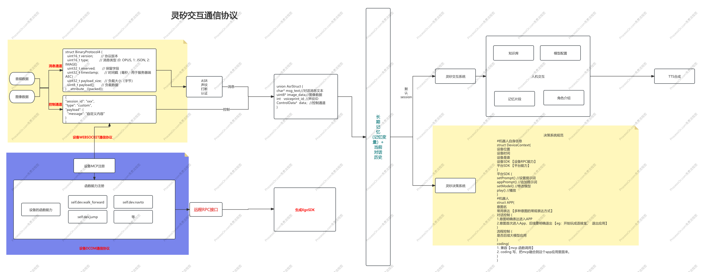

# 灵矽决策系统

## 目录

- [概述](#概述)
  - [核心特性](#核心特性)
  - [应用场景](#应用场景)
- [系统架构](#系统架构)
  - [整体流程](#整体流程)
  - [核心组件](#核心组件)
- [决策系统API接口](#决策系统api接口)
  - [对外执行API](#对外执行api)
  - [API调用示例](#api调用示例)
- [核心概念](#核心概念)
  - [对话控制模式](#对话控制模式)
  - [决策意图识别机制](#决策意图识别机制)
  - [系统命令意图表](#系统命令意图表)
- [执行环境API](#执行环境api)
  - [API能力与设备匹配机制](#api能力与设备匹配机制)
  - [1. 机器人API (RPC调用)](#1-机器人api-rpc调用)
  - [2. 平台API (ExecutionCode内部调用)](#2-平台api-executioncode内部调用)
  - [3. MCP协议调用](#3-mcp协议调用)
  - [代码执行流程](#代码执行流程)
  - [RequestID生命周期管理](#requestid生命周期管理)
- [技术规范](#技术规范)
  - [机器人上下文管理器](#机器人上下文管理器)
  - [平台SDK接口](#平台sdk接口)
  - [应用框架规范](#应用框架规范)
- [开发指南](#开发指南)
  - [创建自定义APP](#创建自定义app)
  - [应用示例](#应用示例)
- [最佳实践](#最佳实践)
  - [完整交互流程示例](#完整交互流程示例)
- [附录](#附录)
  - [术语表](#术语表)
  - [参考资料](#参考资料)

## 概述

灵矽决策系统是基于灵矽交互系统构建的具身智能机器人决策引擎，专为具备物理形态的智能机器人提供上下文感知的决策能力。支持多模态交互、意图识别和智能推理，使机器人能够理解用户需求并执行相应的物理动作和智能服务。

**主要调用方式**：
- **RESTful API**：同步和异步应用执行接口，支持批量处理和状态查询
- **流式API**：实时数据推送和状态更新，适用于需要实时反馈的场景
- **应用管理**：SmartApp注册、查询和管理接口，支持动态扩展和定制化


## 系统架构

### 整体流程



**流程图链接**: [ProcessOn 在线编辑](https://www.processon.com/view/link/68ebb76f40384a24f740cc46)访问密码：37QW

### 核心组件

系统由以下四个核心组件构成：

1. **决策系统API接口 (DecisionSystemAPI)**：提供应用执行、状态查询和RequestID管理的核心接口
2. **机器人上下文管理器 (RobotContext)**：管理机器人物理状态、环境感知和运动能力 【机器API】
3. **平台SDK (PlatformSDK)**：提供AI推理、多模态交互和云端服务能力 【平台API】
4. **智能应用框架 (SmartApp)**：定义具身智能应用的标准结构和执行模式

## 决策系统API接口

### 对外执行API

决策系统对外提供的主要API接口，结合OpenAI Function Call能力，根据应用配置自动选择执行模式。

#### 核心执行接口

```golang
type DecisionSystemAPI interface {
    // 统一应用执行接口（根据app配置自动选择同步/流式执行）
    ExecuteApp(request AppExecutionRequest) (AppExecutionResponse, error)
    
    // 流式应用执行接口（当app支持流式输出时使用）
    ExecuteAppStream(request AppExecutionRequest) (<-chan StreamResponse, error)
    
    // RequestID管理
    GetExecutionStatus(requestId string) (ExecutionStatusResponse, error)
    GetExecutionResult(requestId string) (AppExecutionResponse, error)
    
    // 应用管理
    ListApps() ([]SmartApp, error)
    GetApp(appId string) (SmartApp, error)
}


// 执行状态响应
type ExecutionStatusResponse struct {
    RequestID   string          `json:"request_id"`
    Status      ExecutionStatus `json:"status"`
    Progress    float64         `json:"progress"`    // 执行进度 0-1
    Message     string          `json:"message"`     // 状态描述
    StartTime   int64           `json:"start_time"`
    UpdateTime  int64           `json:"update_time"`
    CompletedAt *int64          `json:"completed_at,omitempty"`
}

// 流式响应数据结构
type StreamResponse struct {
    RequestId string      `json:"requestId"`
    Type      string      `json:"type"` // 'progress' | 'data' | 'complete' | 'error'
    Timestamp int64       `json:"timestamp"`
    Payload   interface{} `json:"payload"`
}


// 应用执行请求
type AppExecutionRequest struct {
    RequestID    string                 `json:"request_id"`    // 请求唯一标识
    AppID        string                 `json:"app_id"`        // 应用ID
    UserInput    string                 `json:"user_input"`    // 用户输入
    Parameters   map[string]interface{} `json:"parameters"`    // 执行参数
    RobotContext *RobotContext          `json:"robot_context"` // 机器人上下文
    UserID       string                 `json:"user_id"`       // 用户ID
    Streaming    bool                   `json:"streaming"`     // 是否启用流式输出
}

// 应用执行响应
type AppExecutionResponse struct {
    RequestID     string                 `json:"request_id"`     // 请求ID
    Status        ExecutionStatus        `json:"status"`         // 执行状态
    Result        *ExecutionResult       `json:"result,omitempty"` // 执行结果
    Error         *ExecutionError        `json:"error,omitempty"`  // 错误信息
    StreamChannel string                 `json:"stream_channel,omitempty"` // 流式输出通道
    Timestamp     int64                  `json:"timestamp"`      // 时间戳
}
```

#### OpenAI Function Call集成

系统支持将SmartApp作为OpenAI Function Call的工具函数，实现智能化的应用调用：

**执行模式自动选择**：
- 系统根据SmartApp的`SupportStreaming`配置自动选择`ExecuteApp`或`ExecuteAppStream`
- 无需手动判断，简化调用逻辑
- 支持意图识别自动匹配合适的应用
- 根据session和SmartApp的对话控制模式，智能选择合适的APP执行，支持多APP协同或单APP精准调用

#### API调用示例

```golang
// 1. 生成RequestID并注册
requestID := generateRequestID()
metadata := RequestMetadata{
    AppID:      "weather_query_001",
    UserID:     "user123",
    UserInput:  "今天天气怎么样",
    Parameters: map[string]interface{}{"location": "北京"},
    CreatedAt:  time.Now().Unix(),
    Status:     "pending",
}


// 2. 查询应用信息，确定执行模式
app, err := decisionAPI.GetApp("weather_query_001")
if err != nil {
    log.Fatal(err)
}

// 3. 根据应用配置选择执行方式
request := AppExecutionRequest{
    RequestID:    requestID,
    AppID:        "weather_query_001",
    UserInput:    "今天天气怎么样",
    Parameters:   map[string]interface{}{"location": "北京"},
    RobotContext: robotContext,
    UserID:       "user123",
    Streaming:    app.SupportStreaming, // 根据app配置决定
}

// 4. 同步执行（适用于查询类、工具类应用）
if !app.SupportStreaming {
    response, err := decisionAPI.ExecuteApp(request)
    if err != nil {
        log.Fatal(err)
    }
    fmt.Printf("执行结果: %s\n", response.Result.Output)
}

// 5. 异步执行和状态查询示例
go func() {
    // 异步执行应用
    response, err := decisionAPI.ExecuteApp(request)
    if err != nil {
        log.Printf("执行失败: %v", err)
    }
}()

```

## 核心概念

### 对话控制模式

灵矽决策系统支持两种对话控制模式，以适应不同类型的应用场景：

#### 1. ExplicitIntent（明确意图模式）

每次都需要明确表达意图才能进入APP，适用于功能性查询。

**特点**：
- 无状态交互，每次都需要重新表达意图
- 适用于查询类、工具类应用
- 系统响应后自动退出应用上下文

**示例场景：天气查询**
```
用户: "今天天气怎么样"
系统: "今天北京晴天，温度25度"
用户: "明天呢"  
系统: "请明确说明您要查询什么" // 需要重新明确意图
用户: "明天天气怎么样"
系统: "明天北京多云，温度23度"
```

#### 2. FirstTimeEntryWithExplicitExit（首次进入保持会话模式）

首次明确进入APP后，自动保持会话状态，需要明确退出，适用于游戏、对话类应用。

**特点**：
- 有状态交互，保持会话上下文
- 适用于游戏类、对话类、多轮交互应用
- 需要明确的退出指令才能结束会话

**示例场景：成语接龙**
```
用户: "开始玩成语接龙"
系统: "好的，成语接龙游戏开始！我先说：一马当先"
用户: "先声夺人"
系统: "人山人海"
用户: "海阔天空"
系统: "空前绝后"
用户: "退出应用"  // 明确退出
系统: "成语接龙游戏结束，谢谢参与！"
```

### 决策意图识别机制

系统采用基于DuerOS技能交互模型的意图识别机制：

- **意图名称 (IntentName)**：定义应用的主要意图标识
- **常用表达 (CommonExpressions)**：预定义的用户表达方式
- **置信度阈值**：意图识别的准确度要求
- **上下文匹配**：结合机器人状态和用户历史进行意图推理

### 系统命令意图表

系统内置一套标准的控制命令，用于管理应用生命周期和系统状态，这些命令具有最高优先级。

#### 应用控制命令

| 命令类型 | 意图名称 | 常用表达 | 功能说明 |
|----------|----------|----------|----------|
| 退出应用 | `system.exit_app` | "退出应用"、"结束"、"退出"、"停止" | 退出当前应用，恢复系统默认状态 |
| 暂停应用 | `system.pause_app` | "暂停"、"等一下"、"先停一下" | 暂停当前应用执行 |
| 恢复应用 | `system.resume_app` | "继续"、"恢复"、"接着来" | 恢复暂停的应用 |
| 重启应用 | `system.restart_app` | "重新开始"、"重启"、"再来一次" | 重启当前应用 |

#### 系统控制命令

| 命令类型 | 意图名称 | 常用表达 | 功能说明 |
|----------|----------|----------|----------|
| 系统状态 | `system.status` | "系统状态"、"当前状态"、"运行情况" | 查询系统和应用运行状态 |
| 应用列表 | `system.list_apps` | "有哪些应用"、"应用列表"、"功能列表" | 显示可用应用列表 |
| 帮助信息 | `system.help` | "帮助"、"怎么用"、"使用说明" | 显示系统使用帮助 |


**命令优先级**：系统命令  > 应用控制命令 > 应用业务命令

## 执行环境API

ExecutionCode内部可以调用以下API能力：

### API能力与设备匹配机制

**设备型号匹配**：
- 机器人API的具体能力取决于机器人的硬件型号和配置
- 系统通过RobotContext中的`robotType`和`robotId`来识别设备型号
- 不同型号的机器人支持的API接口和参数可能不同
- 调用不支持的API时，系统会返回相应的错误信息

**RobotContext上报机制**：
- RobotContext由机器人设备实时上报给决策系统
- 包含机器人的当前状态、位置、传感器数据等信息
- 系统根据上报的信息动态调整可用的API列表
- 确保API调用与机器人的实际能力相匹配

### 1. 机器人API (RPC调用)

```golang
// 运动控制API
robotAPI.MoveTo(x, y, z float64) error                    // 移动到指定位置
robotAPI.Rotate(angle float64) error                      // 旋转指定角度
robotAPI.SetJointAngle(jointId string, angle float64) error // 设置关节角度
robotAPI.ExecuteGesture(gestureId string) error           // 执行预定义手势
robotAPI.Walk(direction string, speed float64) error      // 行走控制
robotAPI.Stop() error                                     // 停止所有运动


// 表达API
robotAPI.SetLED(color string, brightness float64) error   // 控制LED表情灯
robotAPI.PlaySound(audioFile string, volume float64) error // 播放音频
robotAPI.Speak(text string, emotion string) error         // 语音合成播放
robotAPI.SetFacialExpression(expression string) error     // 设置面部表情
```

### 2. 平台API (ExecutionCode内部调用)

**作用范围**：platformAPI仅供ExecutionCode内部代码调用，用于控制当前执行会话的状态和行为。

```golang
// 模型控制API（会话级别）
platformAPI.SetModel(modelId string, config ModelConfig) error     // 切换对话模型
platformAPI.SetTemperature(temperature float64) error              // 调整模型温度
platformAPI.SetPrompt(systemPrompt string) error                   // 设置系统提示词（核心API）
platformAPI.AppendContext(context string) error                    // 添加上下文信息


// 注意：
// 1. platformAPI只能在ExecutionCode内部使用
// 2. TTS播放、音量控制等由系统在LLM处理后自动执行
// 3. 外部系统调用决策系统请使用上述"决策系统API接口"
```

### 3. MCP协议调用

```golang
// MCP工具调用
result, err := callMCP("weather_tool", map[string]interface{}{
    "location": "北京",
    "date":     "today",
})
if err != nil {
    log.Fatal(err)
}

// MCP资源访问
data, err := mcpAPI.GetResource("knowledge_base", "query", map[string]interface{}{
    "question": userInput,
})
if err != nil {
    log.Fatal(err)
}
```

### 代码执行流程

1. **请求初始化**：
   - 生成唯一的RequestID
   - 创建AppExecutionRequest对象
   - 注册到交互系统的执行队列
   - 返回RequestID给调用方

2. **意图识别**：系统识别用户意图，匹配到对应的SmartApp

3. **参数验证**：
   - 验证输入参数是否符合ParameterDefinition要求
   - 执行参数验证规则检查
   - 设置默认值（如果需要）

4. **权限检查**：验证ExecutionCode的API权限配置

5. **环境准备**：
   - 初始化执行环境，注入API对象和上下文
   - 设置流式输出通道（如果启用）
   - 准备RequestID上下文

6. **代码执行**：在沙箱环境中执行ExecutionCode，主要用于：
   - 调用外部API获取数据
   - 设置应用专用提示词
   - 准备上下文信息
   - 通过RequestID更新执行状态

7. **流式处理**（如果启用）：
   - 建立流式输出通道
   - 实时推送执行进度和中间结果
   - 支持客户端通过RequestID订阅流式数据

8. **LLM处理**：如果`RequiresLLMProcessing`为true，系统自动：
   - 使用设置的提示词调用LLM
   - 生成智能回复（支持流式输出）
   - 执行TTS播放

9. **状态管理**：
   - 更新执行状态为completed/failed
   - 保存执行结果到RequestID关联的存储
   - 触发完成回调事件

10. **响应返回**：
    - 同步模式：直接返回最终结果
    - 异步模式：返回RequestID，客户端可通过RequestID查询结果

### RequestID生命周期管理

**RequestID注册机制**：
- 每个SmartApp执行都会生成唯一的RequestID
- RequestID注册到交互系统的执行追踪器中
- 支持通过RequestID查询执行状态、结果和错误信息

**状态查询API**：
```golang
// 查询执行状态
status, err := platformAPI.GetExecutionStatus(requestId)
if err != nil {
    log.Fatal(err)
}

// 取消执行
cancelled, err := platformAPI.CancelExecution(requestId)
if err != nil {
    log.Fatal(err)
}
```

**异步结果获取**：
- 客户端可以通过RequestID轮询或订阅执行结果
- 支持WebSocket实时推送状态变更
- 执行完成后自动触发回调通知

## 技术规范

### 机器人上下文管理器

负责管理机器人的状态信息和物理能力，为具身智能决策提供全面的环境上下文。RobotContext通过机器人设备的实时上报获得，包含设备的型号信息、当前状态和可用能力。

```golang
type RobotContext struct {
    // 机器人基础信息（设备上报）
    RobotId         string      `json:"robotId"`         // 机器人唯一标识
    RobotType       RobotType   `json:"robotType"`       // 机器人类型（人形、轮式、四足等）
    ModelName       string      `json:"modelName"`       // 设备型号名称
    FirmwareVersion string      `json:"firmwareVersion"` // 固件版本
    Location        GeoLocation `json:"location"`        // 机器人当前位置
    Timestamp       time.Time   `json:"timestamp"`       // 当前时间戳

    // 执行环境API
    RobotSDK    RobotSDK    `json:"robotSDK"`    // 机器人硬件控制接口
    PlatformSDK PlatformSDK `json:"platformSDK"` // 平台服务能力接口
}
```

### 平台SDK接口

提供平台级别的服务能力，支持模型管理、内容播放等核心功能。**重要**：平台SDK的所有配置都是APP级别的，当APP退出时系统会自动恢复到默认状态。

```golang
type PlatformSDK interface {
    // 提示词管理（APP级别）
    SetPrompt(prompt string) (bool, error)
    AppendPrompt(additionalPrompt string) (bool, error)
    SetModel(modelConfig ModelConfig) (bool, error)
}

type ModelConfig struct {
    ModelId     string   `json:"modelId"`
    Temperature *float64 `json:"temperature,omitempty"`
    MaxTokens   *int     `json:"maxTokens,omitempty"`
    TopP        *float64 `json:"topP,omitempty"`
}
```

#### APP级别状态管理机制

**状态隔离原则**：
- 每个APP的配置（模型、提示词等）都是独立的
- APP退出时自动清理所有APP级别的配置
- 系统自动恢复到默认状态

**状态生命周期**：
1. **APP启动**：创建独立的配置空间
2. **APP运行**：所有SDK配置仅在当前APP生效
3. **APP退出**：自动触发状态清理和恢复流程
4. **系统恢复**：恢复到系统默认配置


### 应用框架规范

定义智能应用的标准结构，支持意图识别、对话管理和流程控制。参考百度DuerOS技能交互模型设计。

#### 核心数据结构

```go
// 智能应用结构
type Tool struct {
    // 应用基础信息
    AppID       string `json:"app_id"`       // 应用唯一标识
    Name        string `json:"name"`         // 应用名称
    Version     string `json:"version"`      // 版本号
    Description string `json:"description"`  // 应用描述
    
    // 意图配置
    IntentName        string   `json:"intent_name"`         // 主要意图名称
    CommonExpressions []string `json:"common_expressions"`  // 常用表达方式
    
    // 对话控制
    DialogueControl DialogueControlType `json:"dialogue_control"`
    
    // 流程控制
    RequiresLLMProcessing bool `json:"requires_llm_processing"` // 是否需要LLM处理
    IsAsyncExecution     bool `json:"is_async_execution"`      // 是否异步执行
    SupportStreaming     bool `json:"support_streaming"`       // 是否支持流式输出
    
    // 参数配置
    InputParameters []ParameterDefinition `json:"input_parameters,omitempty"` // 输入参数定义
    
    // 应用执行代码
    ExecutionCode *ExecutionCode `json:"execution_code,omitempty"`
}

// 参数定义结构
type ParameterDefinition struct {
    Name        string      `json:"name"`                  // 参数名称
    Type        string      `json:"type"`                  // 参数类型 (string, int, float, bool, object, array)
    Required    bool        `json:"required"`              // 是否必需
    Description string      `json:"description"`           // 参数描述
    DefaultValue interface{} `json:"default_value,omitempty"` // 默认值
}


// 执行状态枚举
type ExecutionStatus string

const (
    StatusPending    ExecutionStatus = "pending"    // 等待执行
    StatusRunning    ExecutionStatus = "running"    // 正在执行
    StatusCompleted  ExecutionStatus = "completed"  // 执行完成
    StatusFailed     ExecutionStatus = "failed"     // 执行失败
    StatusCancelled  ExecutionStatus = "cancelled"  // 已取消
)

// 执行结果
type ExecutionResult struct {
    Output       string                 `json:"output"`                 // 输出内容
    Data         map[string]interface{} `json:"data,omitempty"`         // 结构化数据
    Actions      []RobotAction          `json:"actions,omitempty"`      // 机器人动作序列
    NextPrompt   string                 `json:"next_prompt,omitempty"`  // 下一步提示
    SessionState map[string]interface{} `json:"session_state,omitempty"` // 会话状态
}

// 执行错误
type ExecutionError struct {
    Code    string `json:"code"`    // 错误代码
    Message string `json:"message"` // 错误消息
    Details string `json:"details,omitempty"` // 详细信息
}
```

#### 对话控制类型

```go
type DialogueControlType int

const (
    // 明确意图模式：每次都需要明确意图表达进入APP
    ExplicitIntent DialogueControlType = iota
    
    // 保持会话模式：首次进入后自动保持会话，需要明确退出
    FirstTimeEntryWithExplicitExit
)
```

#### 应用执行代码框架

应用执行代码是一个轻量级的初始化代码块，主要用于设置应用专用的提示词、调用外部API获取数据，并为后续的LLM处理做准备。ExecutionCode执行完成后，如果`RequiresLLMProcessing`为true，系统会自动调用LLM进行智能回复和TTS播放。支持流式输出和异步执行状态查询。

```go
// 应用执行代码结构
type ExecutionCode struct {
    Language    string            `json:"language"`     // 代码语言 (javascript, python, go等)
    Code        string            `json:"code"`         // 执行代码
    Timeout     int               `json:"timeout"`      // 执行超时时间(秒)
    Environment map[string]string `json:"environment"`  // 环境变量
    
    // API权限配置
    Permissions *APIPermissions `json:"permissions,omitempty"`
    
    // 流式输出配置
    StreamConfig *StreamConfig `json:"stream_config,omitempty"`
}

// API权限配置
type APIPermissions struct {
    RobotAPI    []string `json:"robot_api"`    // 允许调用的机器人API列表
    PlatformAPI []string `json:"platform_api"` // 允许调用的平台API列表
    MCPTools    []string `json:"mcp_tools"`    // 允许调用的MCP工具列表
}

// 流式输出配置
type StreamConfig struct {
    EnableStreaming   bool   `json:"enable_streaming"`   // 是否启用流式输出
    ChunkSize        int    `json:"chunk_size"`         // 数据块大小
    FlushInterval    int    `json:"flush_interval"`     // 刷新间隔(毫秒)
    StreamChannel    string `json:"stream_channel"`     // 流式输出通道名称
}

// 机器人动作定义
type RobotAction struct {
    ActionType   string                 `json:"action_type"`   // 动作类型
    ActionID     string                 `json:"action_id"`     // 动作ID
    Parameters   map[string]interface{} `json:"parameters"`    // 动作参数
    Duration     int                    `json:"duration"`      // 执行时长(毫秒)
    Priority     int                    `json:"priority"`      // 优先级
    Blocking     bool                   `json:"blocking"`      // 是否阻塞执行
}
```


## 开发指南

### 创建自定义APP

#### 开发流程

1. **需求分析**：确定应用功能和交互模式
2. **意图设计**：定义意图名称和常用表达方式
3. **对话模式选择**：根据应用特性选择合适的对话控制模式
4. **功能实现**：实现核心业务逻辑
5. **MCP集成**：根据需要集成外部工具和服务
6. **测试验证**：进行功能测试和用户体验验证


#### 配置要点

| 配置项 | 说明 | 选择建议 |
|--------|------|----------|
| DialogueControl | 对话控制模式 | 查询类用ExplicitIntent，游戏类用FirstTimeEntryWithExplicitExit |
| RequiresLLMProcessing | 是否需要LLM处理和TTS播放 | 需要智能回复和语音播放时设为true |
| IsAsyncExecution | 是否异步执行 | 需要长时间处理或不阻塞用户交互时设为true |
| ExecutionCode | 应用执行代码 | 需要设置提示词、调用外部API或准备数据时配置 |


### 应用示例

#### 示例1：成语接龙游戏

适用于多轮交互的游戏类应用，需要保持会话状态。

```go
func CreateChengYuApp() *SmartApp {
    return &SmartApp{
        AppID:       "chengyu_game_001",
        Name:        "成语接龙",
        Version:     "1.0.0",
        Description: "成语接龙游戏应用",
        
        IntentName: "play_chengyu",
        CommonExpressions: []string{
            "开始玩成语接龙", "我要玩成语接龙",
            "成语接龙游戏", "玩成语接龙",
        },
        
        DialogueControl: FirstTimeEntryWithExplicitExit,
        RequiresLLMProcessing: true,
        IsAsyncExecution: false, // 游戏类应用通常需要同步响应
        
        ExecutionCode: &ExecutionCode{
            Language: "javascript",
            Timeout:  5,
            Code: `
// 成语接龙游戏初始化
function initChengYuGame(userInput, context) {
 
    // 设置游戏专用提示词
    platformAPI.setPrompt(\`你是成语接龙游戏助手。游戏规则：
1. 用户说成语，你要接一个以用户成语最后一个字开头的成语
2. 保持游戏氛围，鼓励用户继续
3. 如果用户说的不是成语或接不上，友善提醒
4. 游戏开始时你先说一个成语
5. 用户可以说"退出应用"、"结束"、"退出"来结束游戏

当前游戏状态：已进入成语接龙模式
请开始游戏，先说一个成语。\`);
    

    
    return ""; // 返回空字符串，让LLM根据提示词生成回复
}
            `,
            Permissions: &APIPermissions{
                PlatformAPI: []string{"setPrompt", "saveAppState", "onAppExit"},
            },
        },
    }
}
```

#### 示例2：天气查询

适用于功能性查询，无需保持会话状态。

```go
func CreateWeatherApp() *SmartApp {
    return &SmartApp{
        AppID:       "weather_query_001",
        Name:        "天气查询",
        Version:     "1.0.0",
        Description: "天气信息查询应用",
        
        IntentName: "query_weather",
        CommonExpressions: []string{
            "今天天气怎么样", "查询天气",
            "天气预报", "明天下雨吗",
        },
        
        DialogueControl: ExplicitIntent,
        RequiresLLMProcessing: true,
        IsAsyncExecution: true, // 天气查询可能需要调用外部API，适合异步处理
        
        ExecutionCode: &ExecutionCode{
            Language: "javascript",
            Timeout:  5,
            Code: `
// 天气查询初始化
async function initWeatherQuery(userInput, context) {
    // 获取机器人位置信息
    const location = context.robotContext.pose.position || "当前位置";
    
    // 调用天气API获取数据
    const weatherData = await callMCP("weather_api", {
        location: location,
        query: userInput
    });
    
    if (!weatherData.success) {
        return "抱歉，无法获取天气信息，请稍后再试。";
    }
    
    // 设置天气查询专用提示词，包含天气数据
    platformAPI.appendPrompt(\`你是天气助手。当前天气数据：
位置：\${weatherData.location}
天气：\${weatherData.condition}
温度：\${weatherData.temperature}度
湿度：\${weatherData.humidity}%
请根据这些数据，用友好的语气回答用户的天气查询。\`);
    
    return ""; // 返回空字符串，让LLM根据提示词和天气数据生成回复
}
            `
        },
    }
}
```

#### 示例3：物品搬运任务

适用于具身智能机器人的物理操作任务，结合视觉感知和运动控制。

```go
func CreateObjectTransportApp() *SmartApp {
    return &SmartApp{
        AppID:       "object_transport_001",
        Name:        "物品搬运",
        Version:     "1.0.0",
        Description: "智能物品搬运任务应用",
        
        IntentName: "transport_object",
        CommonExpressions: []string{
            "帮我搬运这个", "把这个拿到那边",
            "搬运物品", "移动这个东西",
        },
        
        DialogueControl: FirstTimeEntryWithExplicitExit,
        RequiresLLMProcessing: true,
        IsAsyncExecution: true, // 物理操作任务需要异步执行
        
        ExecutionCode: &ExecutionCode{
            Language: "javascript",
            Timeout:  30, // 物理任务需要更长的超时时间
            Code: `
// 物品搬运任务初始化
async function initObjectTransport(userInput, context) {
    // 获取机器人当前状态
    const robotPose = await robotAPI.getPose();
    const visionData = await robotAPI.getVisionData();
    
    // 检测目标物品
    const objects = await robotAPI.detectObjects();
    const targetObject = identifyTargetObject(userInput, objects);
    
    if (!targetObject) {
        platformAPI.setPrompt(\`你是搬运助手。无法识别要搬运的物品，请用友好的语气询问用户具体要搬运什么物品，并建议用户指向或描述物品的特征。\`);
        return "";
    }
    
    // 规划搬运路径
    const transportPlan = await planTransportPath(robotPose, targetObject, userInput);
    
    if (!transportPlan.feasible) {
        platformAPI.setPrompt(\`你是搬运助手。搬运任务存在困难：\${transportPlan.issue}。请友好地向用户说明情况并询问是否需要调整任务。\`);
        return "";
    }
    
    // 开始执行搬运任务
    executeTransportTask(transportPlan);
    
    platformAPI.setPrompt(\`你是搬运助手。我已经开始执行搬运任务，正在移动到物品位置。请用鼓励的语气告知用户任务进展，并提醒用户保持安全距离。\`);
    
    return "";
}

// 执行搬运任务
async function executeTransportTask(plan) {
    try {
        // 移动到物品位置
        await robotAPI.moveTo(plan.objectPosition.x, plan.objectPosition.y, plan.objectPosition.z);
        
        // 执行抓取动作
        await robotAPI.executeGesture("grasp_object");
        
        // 移动到目标位置
        await robotAPI.moveTo(plan.targetPosition.x, plan.targetPosition.y, plan.targetPosition.z);
        
        // 放置物品
        await robotAPI.executeGesture("release_object");
        
        // 任务完成提示
        robotAPI.setFacialExpression("happy");
        
    } catch (error) {
        robotAPI.setFacialExpression("confused");
        console.error("搬运任务执行失败:", error);
    }
}
            `,
            Permissions: &APIPermissions{
                PlatformAPI: []string{"setPrompt"},
                RobotAPI:    []string{"moveTo", "getPose", "getVisionData", "detectObjects", "executeGesture", "setFacialExpression"},
            },
        },
    }
}
```

#### 对话控制选择

| 应用类型 | 推荐模式 | 原因 |
|----------|----------|------|
| 查询类应用 | ExplicitIntent | 用户期望快速获得结果，无需保持状态 |
| 游戏类应用 | FirstTimeEntryWithExplicitExit | 需要多轮交互，保持游戏状态 |
| 教育类应用 | FirstTimeEntryWithExplicitExit | 学习过程需要连续性 |
| 工具类应用 | ExplicitIntent | 功能相对独立，无需状态保持 |
| 物理操作应用 | FirstTimeEntryWithExplicitExit | 需要持续监控任务执行状态 |
| 巡逻监控应用 | FirstTimeEntryWithExplicitExit | 需要保持长期运行状态 |
| 服务接待应用 | ExplicitIntent | 每次服务相对独立，快速响应 |

## 最佳实践

### 完整交互流程示例

以下是一个完整的系统交互流程，展示了从应用启动到退出的全过程，包括系统命令处理和状态恢复：

#### 场景：成语接龙游戏完整流程

```
=== 1. 应用启动 ===
用户: "开始玩成语接龙"
系统: [意图识别] -> play_chengyu
系统: [创建APP实例] -> chengyu_game_001
系统: [执行ExecutionCode] -> 设置游戏提示词
系统: [LLM处理] -> "好的！成语接龙游戏开始！我先说：一马当先"

=== 2. 游戏进行中 ===
用户: "先声夺人"
系统: [保持会话状态] -> 继续游戏模式
系统: [LLM处理] -> "人山人海"

用户: "海阔天空"
系统: [保持会话状态] -> 继续游戏模式
系统: [LLM处理] -> "空前绝后"

=== 3. 系统命令处理 ===
用户: "退出应用"
系统: [系统命令识别] -> system.exit_app (最高优先级)
系统: [触发APP退出流程]:
  1. 保存APP状态 -> saveAppState()
  2. 清理APP配置 -> clearAppState()
  3. 恢复系统默认 -> restoreSystemDefaults()
  4. 触发退出回调 -> onAppExit()
系统: [LLM处理] -> "成语接龙游戏结束，谢谢参与！您一共玩了3轮。"

=== 4. 系统状态恢复 ===
系统状态: 
- 模型配置: 恢复到默认模型
- 提示词: 恢复到系统默认提示词
- 会话状态: 清空APP会话数据
- 音量设置: 保持用户设置
- 当前APP: null

=== 5. 后续交互 ===
用户: "今天天气怎么样"
系统: [意图识别] -> query_weather
系统: [创建新APP实例] -> weather_query_001
系统: [执行ExecutionCode] -> 调用天气API，设置天气提示词
系统: [LLM处理] -> "今天北京晴天，温度25度，适合外出活动。"
系统: [自动退出] -> ExplicitIntent模式，响应后自动退出
```

#### 紧急情况处理

```
=== 紧急停止场景 ===
用户: "紧急停止"
系统: [紧急命令识别] -> system.emergency_stop (最高优先级)
系统: [立即执行]:
  1. 停止所有机器人运动 -> robotAPI.stop()
  2. 暂停当前APP执行
  3. 进入安全模式
  4. 播放安全提示音
系统: "已紧急停止所有操作，机器人进入安全模式。"

=== 恢复正常操作 ===
用户: "恢复正常"
系统: [系统命令识别] -> system.resume_app
系统: [恢复流程]:
  1. 退出安全模式
  2. 恢复APP执行（如果有）
  3. 恢复正常交互
系统: "系统已恢复正常，可以继续操作。"
```

### 参考资料

- [DuerOS技能交互模型](https://dueros.baidu.com/docs)
- [MCP协议规范](https://spec.modelcontextprotocol.io/)
- [灵矽交互系统文档](../灵矽交互/readme.md)


---

*文档版本: v1.2.0*  
*最后更新: 2024年12月*